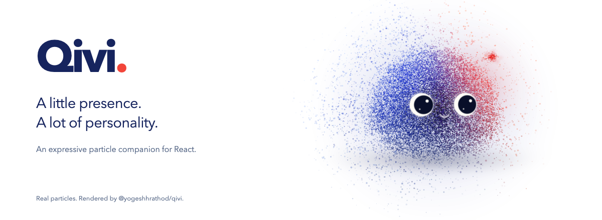
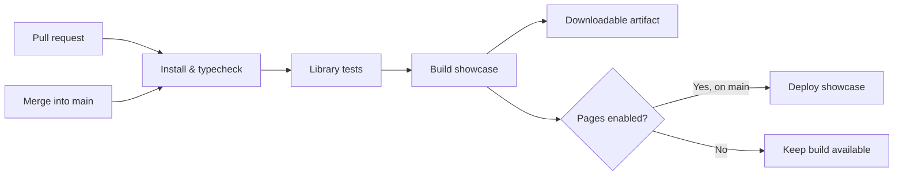

<div align="center">

<picture>
  <source media="(prefers-color-scheme: dark)" srcset="docs/assets/qivi-banner-dark.png" />
  <source media="(prefers-color-scheme: light)" srcset="docs/assets/qivi-banner-light.png" />
  
</picture>

[](https://github.com/yogeshhrathod/qivi/actions/workflows/showcase.yml)


**An expressive particle companion for your React app.**

[Live showcase](https://yogeshhrathod.github.io/qivi/) · [Quick start](#quick-start) · [Library API](library/qivi/README.md) · [Customization guide](library/qivi/docs/performance.md)

</div>

Qivi gives your interface a face that listens, thinks, and responds. Thousands of particles form a companion you can shape with personalities, expressions, palettes, and voice input—from a small SVG avatar to a full-page particle layer.

The banner is a browser capture of the real `QiviAvatar` component.

## Meet Qivi

| | What you can do |
| :--- | :--- |
| ✨ **Give it personality** | Blend states and expressions; customize palettes, eyes, proportions, and behavior. |
| 🎙️ **Make it listen and speak** | React to microphone input, audio playback, speech synthesis, or manual voice signals. |
| 💙 **Change its shape** | Morph between built-in silhouettes or create your own radial shape. |
| 🎬 **Direct a performance** | Time expressions and gestures to an actual audio playback clock. |
| 🪶 **Fit the interface** | Use a contained canvas, a viewport layer, or the static SVG fallback. |
| ♿ **Respect motion preferences** | Support reduced motion and pause contained avatars when offscreen. |

The demo includes an interactive studio, an avatar gallery, and a mock conversation. Try themes, states, shapes, microphone input, and spoken replies without configuring an AI backend. Chat replies and findings are synthetic demo data.

## Showcase

**[Open the live showcase →](https://yogeshhrathod.github.io/qivi/)**

Explore the studio, gallery, and mock conversation directly in your browser. Microphone access requires your permission; the showcase uses synthetic chat data.

Every merge into `main` runs the checks and updates the site through GitHub Pages. Follow progress in [Actions](https://github.com/yogeshhrathod/qivi/actions/workflows/showcase.yml), or trigger **CI & showcase** manually. The latest successful run also includes a downloadable **showcase-dist** artifact.

To preview an artifact locally, extract it into a folder named `qivi`, serve its parent with `python3 -m http.server 8080`, and open `http://localhost:8080/qivi/`.

Deployment uses [GitHub's official Pages workflow](https://docs.github.com/en/pages/getting-started-with-github-pages/using-custom-workflows-with-github-pages).

## Quick start

```sh
git clone https://github.com/yogeshhrathod/qivi.git
cd qivi
npm ci
npm run dev
```

Open the local URL printed by Vite. A WebGL-capable browser renders the particle avatar; small sizes and static quality use an SVG fallback.

## Add Qivi to your app

The package name is **`@yogeshhrathod/qivi`**. It has not been published to npm yet. Build an installable archive locally:

```sh
cd library/qivi
npm pack
```

In your consuming project, install that archive together with its peer dependencies:

```sh
npm install /path/to/yogeshhrathod-qivi-0.1.0.tgz react@^19 react-dom@^19 three@^0.180
```

```tsx
import { QiviAvatar } from "@yogeshhrathod/qivi";
import "@yogeshhrathod/qivi/styles.css";

export function Companion() {
  return (
    <QiviAvatar
      size={160}
      personality="core"
      state="idle"
      theme="auto"
      reducedMotion="auto"
    />
  );
}
```

Import the stylesheet once. In a framework with server components, render the avatar inside a client component. Explore the [full API](library/qivi/README.md) and [character, voice, and performance guide](library/qivi/docs/performance.md).

## Develop & ship

| Command | Purpose |
| :--- | :--- |
| `npm run dev` | Start the interactive demo. |
| `npm run typecheck` | Check demo TypeScript. |
| `npm test` | Build the library and run its tests, including documentation examples. |
| `npm run build` | Build the demo for hosting at `/`. |
| `npm run build:showcase` | Build the demo for GitHub Pages at `/qivi/`. |
| `npm run build:library` | Build the npm library and declarations. |

### Continuous integration & deployment



Pull requests validate the demo and library. Pushes to `main`, including merged pull requests, build the showcase and deploy it when Pages is enabled. Manual runs are available in Actions. npm publishing remains a separate release step.

### Project map

```text
src/                 Demo, studio, gallery, and mock conversation
library/qivi/src/    React components, particle engine, voice, and presets
library/qivi/docs/   Integration and customization guide
library/qivi/tests/  Library behavior and documentation checks
docs/assets/        README visuals
.github/workflows/  CI and GitHub Pages deployment
```

## Brand assets


[Qivi wordmark](library/qivi/assets/qivi-wordmark.svg) · [SVG icon](library/qivi/assets/qivi-icon.svg) · [Transparent PNG](library/qivi/assets/qivi-icon.png) · [Real avatar banner](docs/assets/qivi-banner.png)

The icon is exported from the library's `QiviIcon` component using its default palette. The banner captures `QiviAvatar` running in a browser. See [capture details](docs/assets/README.md) to reproduce them.

## Maintainer

Built by [Yogesh Rathod](https://github.com/yogeshhrathod). Suggestions and bugs are welcome in [Issues](https://github.com/yogeshhrathod/qivi/issues).

An open-source license has not been selected yet.
