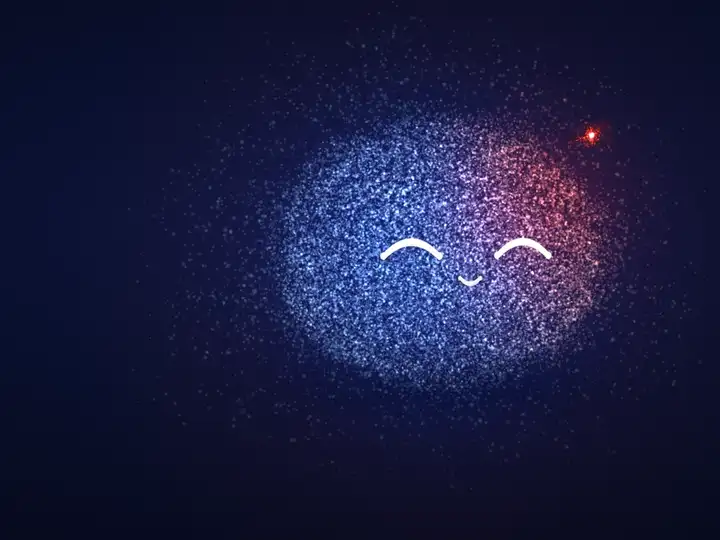
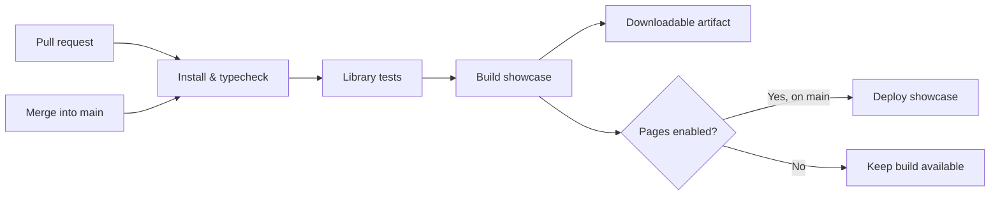

<div align="center">

<picture>
  <source media="(prefers-color-scheme: dark)" srcset="docs/assets/qivi-banner-dark.png" />
  <source media="(prefers-color-scheme: light)" srcset="docs/assets/qivi-banner-light.png" />
  
</picture>

[](https://www.npmjs.com/package/qivi-react)
[](https://github.com/yogeshhrathod/qivi/actions/workflows/showcase.yml)


**An expressive particle companion for your React app.**

[GitHub](https://github.com/yogeshhrathod/qivi) · [Live showcase](https://yogeshhrathod.github.io/qivi/) · [Try it on StackBlitz](https://stackblitz.com/github/yogeshhrathod/qivi/tree/main/examples/quickstart?file=src%2FApp.tsx) · [Library API](library/qivi/README.md) · [Customization guide](library/qivi/docs/performance.md) · [Sponsor](https://github.com/sponsors/yogeshhrathod)

</div>

Qivi gives your AI a face that listens, thinks, and talks. Thousands of GPU particles form a companion with conversation states, 12 expressions, six characters, and a mouth that follows real audio, from a small SVG avatar to a full-page particle layer.

<p align="center">
  
</p>

<p align="center"><sub>Every image here is a browser capture of the real <code>QiviAvatar</code> component.</sub></p>

## Install

```sh
npm install qivi-react react@^19 react-dom@^19 three@^0.180
```

```tsx
import { QiviAvatar } from "qivi-react";
import "qivi-react/styles.css";

export function Companion() {
  return <QiviAvatar size={160} state="idle" />;
}
```

Import the stylesheet once. In a framework with server components, render the avatar inside a client component. No AI provider is built in: you pass a state and, optionally, an audio source.

[](https://stackblitz.com/github/yogeshhrathod/qivi/tree/main/examples/quickstart?file=src%2FApp.tsx)

## Give your voice agent a face

Map your agent's lifecycle to Qivi states and hand it the audio you already play. The mouth follows the real waveform.

```tsx
import { QiviAvatar, QiviVoice, type QiviState } from "qivi-react";

// listening while the user speaks, thinking while the model works, talking while audio plays
const [state, setState] = useState<QiviState>("idle");
const voice = useMemo(() => QiviVoice.fromMediaElement(ttsAudio), [ttsAudio]);

<QiviAvatar state={state} voice={state === "talking" ? voice : null} />
```

The [OpenAI Realtime example](examples/openai-realtime) wires this to a live speech-to-speech session over WebRTC, with the API key kept on a small server.

## Meet Qivi

| | What you can do |
| :--- | :--- |
| ✨ **Give it personality** | Blend states and expressions; customize palettes, eyes, proportions, and behavior. |
| 🎙️ **Make it listen and speak** | React to microphone input, audio playback, speech synthesis, or manual voice signals. |
| 💙 **Change its shape** | Morph between built-in silhouettes or create your own radial shape. |
| 🎬 **Direct a performance** | Time expressions and gestures to an actual audio playback clock. |
| 🪶 **Fit the interface** | Use a contained canvas, a viewport layer, or the static SVG fallback. |
| ♿ **Respect motion preferences** | Support reduced motion and pause contained avatars when offscreen. |

## Examples

| Example | What it shows |
| :--- | :--- |
| [Quickstart](examples/quickstart) | Every state, expression, and character in a minimal Vite app. [Open in StackBlitz](https://stackblitz.com/github/yogeshhrathod/qivi/tree/main/examples/quickstart?file=src%2FApp.tsx). |
| [OpenAI Realtime](examples/openai-realtime) | A voice agent whose face listens, thinks, and talks with the conversation. |
| [Live showcase](https://yogeshhrathod.github.io/qivi/) | Studio, character gallery, and a mock conversation (synthetic replies, no backend). |

It is also on GitHub Packages as [`@yogeshhrathod/qivi`](https://github.com/yogeshhrathod/qivi/pkgs/npm/qivi); see the [library README](library/qivi/README.md#use-in-another-project) for that setup. Explore the [full API](library/qivi/README.md) and the [character, voice, and performance guide](library/qivi/docs/performance.md).

## Contributor & AI onboarding

Start with [AGENTS.md](AGENTS.md) and [CONTRIBUTING.md](CONTRIBUTING.md). Read the [architecture](docs/architecture.md), [development guide](docs/development.md), and [release guide](docs/releasing.md) before extending the project. Node 22 is specified in `.nvmrc`; GitHub Copilot and Claude entry points share the same project guidance.

## Develop & ship

```sh
git clone https://github.com/yogeshhrathod/qivi.git
cd qivi
npm ci
npm run dev
```

Open the local URL printed by Vite. A WebGL-capable browser renders the particle avatar; small sizes and static quality use an SVG fallback. To try unreleased library changes in another app, run `npm pack` in `library/qivi` and install the resulting `qivi-react-<version>.tgz`.

| Command | Purpose |
| :--- | :--- |
| `npm run dev` | Start the interactive demo. |
| `npm run typecheck` | Check demo TypeScript. |
| `npm test` | Build the library and run its tests, including documentation examples. |
| `npm run build` | Build the demo for hosting at `/`. |
| `npm run build:showcase` | Build the demo for GitHub Pages at `/qivi/`. |
| `npm run build:library` | Build the npm library and declarations. |

### Continuous integration & deployment



Pull requests validate the demo and library. Pushes to `main`, including merged pull requests, build the showcase and deploy it to [GitHub Pages](https://yogeshhrathod.github.io/qivi/). Each successful run also keeps a downloadable **showcase-dist** artifact: extract it into a folder named `qivi`, serve its parent with `python3 -m http.server 8080`, and open `http://localhost:8080/qivi/`. Publishing a GitHub Release publishes the library to npm and GitHub Packages; see the [release guide](docs/releasing.md).

### Project map

```text
src/                 Demo, studio, gallery, and mock conversation
examples/            Quickstart and OpenAI Realtime example apps (install from npm)
scripts/             Brand captures and the promo-video composition/renderer
library/qivi/src/    React components, particle engine, voice, and presets
library/qivi/docs/   Integration and customization guide
library/qivi/tests/  Library behavior and documentation checks
docs/assets/        README visuals
.github/workflows/  CI and GitHub Pages deployment
```

## Brand assets


[Qivi wordmark](library/qivi/assets/qivi-wordmark.svg) · [SVG icon](library/qivi/assets/qivi-icon.svg) · [Transparent PNG](library/qivi/assets/qivi-icon.png) · [Social preview](docs/assets/qivi-social.png) · [Expressions loop](docs/assets/qivi-expressions.webp)

The icon is exported from the library's `QiviIcon` component using its default palette. The banners, social preview, expressions loop, and promo video capture `QiviAvatar` running in a browser. See [capture details](docs/assets/README.md) to reproduce them.

## Maintainer

Built by [Yogesh Rathod](https://github.com/yogeshhrathod). Suggestions and bugs are welcome in [Issues](https://github.com/yogeshhrathod/qivi/issues).

Released under the [MIT License](LICENSE).
