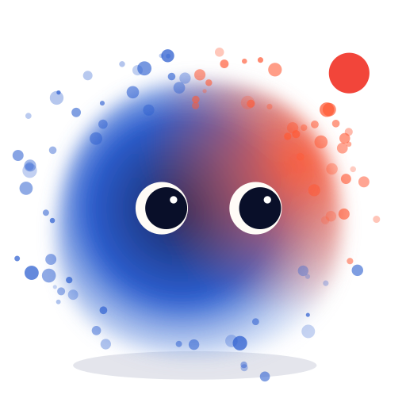

# Qivi React library

<picture>
  <source media="(prefers-color-scheme: dark)" srcset="assets/qivi-wordmark-dark.svg" />
  
</picture>



A particle companion for React 19, with animated states, expressions, themes, shapes, voice reactions, and a static SVG fallback. All library source, styles, and build configuration are contained in this folder. The demo and mock chat backend live outside it.

## Use in another project

Install the package and its peer dependencies from npm:

```sh
npm install qivi react@^19 react-dom@^19 three@^0.180
```

Qivi is also published to GitHub Packages as `@yogeshhrathod/qivi`. To install from there, point the scope at GitHub's registry in your `.npmrc` (`@yogeshhrathod:registry=https://npm.pkg.github.com`, plus a GitHub token with `read:packages`) and install it under the `qivi` alias so the imports below stay the same:

```sh
npm install qivi@npm:@yogeshhrathod/qivi
```

In your React app:

```tsx
import { QiviAvatar } from "qivi";
import "qivi/styles.css";

export function Companion() {
  return <QiviAvatar size={160} personality="core" state="idle" />;
}
```

Import the stylesheet once at the application entry point. Use a bundler such as Vite that supports CSS imports. In frameworks with server components, render Qivi inside a client component.

## Share as a package

Run `npm pack` in this folder to build a portable `qivi-0.1.0.tgz`. Install that file in another project with `npm install /path/to/qivi-0.1.0.tgz`. React, React DOM, and Three.js are peer dependencies and are supplied by the consuming app.

To prepare an npm release, run `npm test` and `npm pack --dry-run` in this folder. The package includes the built library, TypeScript declarations, styles, and integration documentation. Releases are published by the repository's release workflow; see [release guidance](https://github.com/yogeshhrathod/qivi/blob/main/docs/releasing.md). The demo workspace is private and is not published.

Maintained by [Yogesh Rathod](https://github.com/yogeshhrathod). Released under the [MIT License](LICENSE).

## API

- `QiviAvatar`, `QiviAvatarProps`, `QiviAvatarHandle`: animated companion; use a ref to trigger `impulse("bounce")`.
- `QiviIcon`: static SVG avatar.
- `QiviVoice`, `VoiceFrame`: microphone, media, speech synthesis, manual, or simulated voice input.
- `PERSONALITIES`, `STATES`, `EXPRESSIONS`, `PALETTES`, `paletteFor`: presets and palette selection.
- Exported TypeScript types cover personality, state, expression, shape, theme, palette, and impulses.

See `src/QiviAvatar.tsx` for documented props. Common options include `expression`, `theme`, `appearance`, `shape`, `quality`, `reducedMotion`, and `voice`. The default contained avatar pauses offscreen. `layer="viewport"` supports an `anchor` element and a `streamTarget` for particle streams.

## Customization and expressive calls

Use `QiviCharacter` profiles to customize identity, particle proportions, visual presentation, palettes, shapes, blink/gaze behavior and numeric parameters. `expressionStrength`, `expressionDefinition`, `params` and `transitionSpeed` provide deeper control. `createRadialShape` supports custom radial silhouettes. Profiles can be swapped on the same avatar to blend its appearance.

`QiviPerformance` coordinates expression, gesture, shape and character cues against any playback clock. Pair it with `QiviVoice` for waveform-driven speaking animation. It has no ElevenLabs dependency; speech generation and semantic intent belong to the host application.

Read [the full guide](docs/performance.md) for API details, precedence, limitations and a complete React audio example. [llms.txt](llms.txt) is the machine-readable index; [llm.txt](llm.txt) points to it. Both ship with the package.

## Development

```sh
npm run typecheck
npm test
npm run build
```

From the demo repository root, `npm run build:library` builds this package. The demo imports the source through an `qivi` alias, so edits appear immediately during development.

Built-in character identities are exported as `CHARACTERS.qivi`, `CHARACTERS.female` (Nova), `CHARACTERS.male` (Sol), `CHARACTERS.ember` (playful star), `CHARACTERS.sage` (calm mint), and `CHARACTERS.atlas` (protective shield). The `spark` and `diplomat` personalities are available independently of these visual identities.

## Icon assets

The package includes the canonical Qivi icon as [SVG](assets/qivi-icon.svg) and [transparent PNG](assets/qivi-icon.png), exported from `QiviIcon`. Bundlers can import them from `qivi/icon.svg` or `qivi/icon.png`. For a theme-aware React icon, render `QiviIcon` directly.

The banner wordmark is also available at `qivi/wordmark.svg`.

[GitHub](https://github.com/yogeshhrathod/qivi) · [Sponsor Yogesh on GitHub](https://github.com/sponsors/yogeshhrathod)
